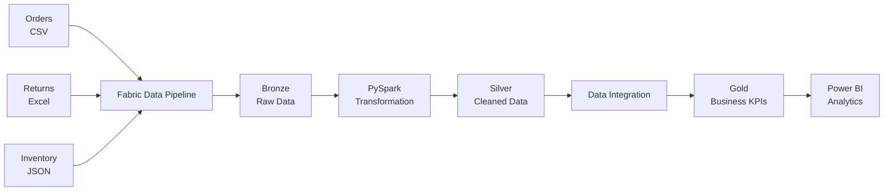
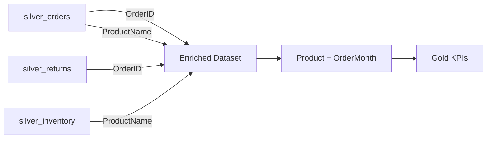
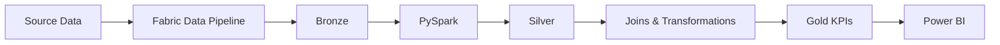

# Retail Data Engineering & Analytics — Microsoft Fabric

An end-to-end retail data engineering pipeline built with **Microsoft Fabric, PySpark, Delta Lake, Medallion Architecture, and Power BI**.

The project ingests retail data from **CSV, Excel, and JSON** sources, applies data-quality transformations, integrates the resulting datasets, and produces business-ready KPIs for analytical reporting.

---

## Project Overview

Retail data commonly arrives from multiple systems with inconsistent formats, schemas, data types, and values.

This project demonstrates a complete data engineering workflow for transforming this raw data into reliable analytical datasets.

The pipeline implements:

- Multi-source data ingestion
- Bronze/Silver/Gold architecture
- PySpark-based data cleaning
- Schema and data-type standardization
- Data validation
- Null and duplicate handling
- Cross-dataset integration
- Business KPI aggregation
- Power BI reporting

---

## Architecture

The solution follows the **Medallion Architecture** using Microsoft Fabric.



---

## Technology Stack

| Area | Technology |
|---|---|
| Cloud Platform | Microsoft Azure |
| Data Platform | Microsoft Fabric |
| Data Ingestion | Fabric Data Pipeline |
| Storage | Fabric Lakehouse |
| Processing | PySpark |
| Table Format | Delta Lake |
| Architecture | Medallion Architecture |
| Visualization | Power BI |
| Version Control | GitHub |

---

## Data Sources

The pipeline integrates three retail datasets.

### Orders

**Format:** CSV

The Orders dataset contains attributes including:

- Order ID
- Customer ID
- Product Name
- Quantity
- Order Date
- Order Amount
- Delivery Status
- Payment Mode
- Shipping Address
- Email
- Promo Code
- Feedback Score

### Returns

**Format:** Excel

The Returns dataset contains attributes including:

- Return ID
- Order ID
- Customer ID
- Product
- Return Reason
- Return Date
- Refund Status
- Pickup Address
- Return Amount

### Inventory

**Format:** JSON

The Inventory dataset contains:

- Product ID
- Product Name
- Stock
- Last Stocked
- Warehouse
- Cost Price
- Availability

---

# Bronze Layer

The Bronze layer is the raw ingestion layer.

Source files are loaded into the Microsoft Fabric Lakehouse using a **Fabric Data Pipeline** and **Copy Data activities**.

### Sources

| Dataset | Source Format |
|---|---|
| Orders | CSV |
| Returns | Excel |
| Inventory | JSON |

### Objectives

- Preserve incoming source data
- Maintain a raw representation of the datasets
- Separate ingestion from transformation
- Provide a reliable source for downstream processing
- Support reprocessing when required

The Bronze layer performs minimal transformation so that source information remains available for subsequent processing.

---

# Silver Layer

The Silver layer contains cleaned, standardized, and validated datasets.

**PySpark** is used to perform data-quality and transformation operations.

### Data Quality Transformations

#### Schema Standardization

Source column names are converted into consistent analytical names.

| Source Column | Silver Column |
|---|---|
| `Order_ID` | `OrderID` |
| `Cust_ID` | `CustomerID` |
| `Product_Name` | `ProductName` |
| `Order_Amount` | `OrderAmount` |
| `Delivery_Status` | `DeliveryStatus` |
| `Payment_Mode` | `PaymentMode` |

#### Data Type Standardization

| Attribute | Target Type |
|---|---|
| Quantity | Integer |
| OrderAmount | Double |
| OrderDate | Date |
| FeedbackScore | Double |
| Stock | Integer |
| CostPrice | Double |
| Available | Boolean |

#### Date Standardization

Multiple source date formats are parsed into a consistent Spark `date` type.

Examples:

```text
2023/07/01
01-07-2023
07/01/2023
2023.07.01
```

#### Currency Normalization

Currency symbols and textual prefixes are removed before numeric conversion.

Examples:

```text
$700       → 700.0
INR 72000  → 72000.0
Rs. 25000  → 25000.0
350USD     → 350.0
```

#### Quantity Normalization

Text-based quantities are converted to integers.

```text
one    → 1
two    → 2
three  → 3
```

#### Email Validation

Email values are validated using a regular-expression pattern.

Invalid values are converted to `NULL`.

#### Address Cleaning

Special characters are removed from shipping addresses while preserving useful address characters such as:

- Letters
- Numbers
- Spaces
- Commas
- Periods
- Hyphens

#### Null Handling

Missing values are handled based on the meaning of each attribute.

Examples:

```text
Quantity        → 0
OrderAmount     → 0.0
DeliveryStatus  → unknown
PaymentMode     → unknown
```

Critical fields such as `CustomerID` and `ProductName` are validated before being retained.

#### Duplicate Handling

Duplicate orders are removed using `OrderID`.

```python
.dropDuplicates(["OrderID"])
```

---

## Silver Tables

The cleaned datasets are stored as Delta tables:

```text
silver_orders
silver_returns
silver_inventory
```

### Silver Inventory Schema

| Column | Data Type |
|---|---|
| `product_id` | String |
| `ProductName` | String |
| `Stock` | Integer |
| `LastStocked` | Date |
| `CostPrice` | Double |
| `Warehouse` | String |
| `Available` | Boolean |

---

# Gold Layer

The Gold layer contains business-ready analytical data.

The cleaned Silver datasets are integrated using Spark joins.



---

## Data Integration

### Orders + Returns

Orders and Returns are joined using:

```text
OrderID
```

A **LEFT JOIN** is used so that orders without return records remain in the enriched dataset.

### Orders + Inventory

Orders are joined with Inventory using:

```text
ProductName
```

Table aliases are used to avoid ambiguity when columns with the same name exist across multiple datasets.

Example:

```python
orders = spark.table("silver_orders").alias("o")
returns = spark.table("silver_returns").alias("r")
inventory = spark.table("silver_inventory").alias("i")
```

Explicit column selection is then used before aggregation to ensure that the final dataset contains unambiguous fields.

---

# Gold Data Grain

The Gold dataset is aggregated at:

```text
ProductName + OrderMonth
```

This means each Gold record represents the calculated metrics for a specific product during a specific month.

`OrderMonth` is derived from `OrderDate`.

Example:

| ProductName | OrderMonth |
|---|---|
| Apple iPhone13 | 2023-06 |
| Oneplus Nord | 2023-07 |
| Samsung Galaxy | 2023-07 |

Understanding the data grain is important because it determines how metrics such as orders, revenue, returns, and customers should be calculated.

---

# Business KPIs

The Gold layer produces the following metrics:

| KPI | Description |
|---|---|
| Total Orders | Number of orders |
| Unique Customers | Distinct customers |
| Total Returns | Number of returns |
| Return Rate | Returns as a percentage of orders |
| Total Revenue | Sum of order amounts |
| Average Order Value | Average order amount |
| Total Stock | Inventory quantity |
| Average Cost | Average product cost |
| Net Profit | Project-defined profitability metric |

### Return Rate

```text
Return Rate =
(Total Returns / Total Orders) × 100
```

### Total Revenue

```text
Total Revenue =
SUM(OrderAmount)
```

### Average Order Value

```text
Average Order Value =
AVG(OrderAmount)
```

---

# Gold Table

The final analytical dataset is stored as:

```text
gold_product_month_kpis
```

The table is designed for downstream analytical consumption through Power BI.

---

# Power BI

The Gold dataset provides the foundation for a retail analytics dashboard.

### Key Metrics

- Total Revenue
- Total Orders
- Unique Customers
- Total Returns
- Return Rate
- Average Order Value
- Inventory
- Profitability

### Potential Analysis

- Revenue by Product
- Revenue by Month
- Returns by Product
- Return Rate by Product
- Inventory by Product
- Profitability by Product
- Order trends over time

### Filters

- Product
- Order Month

The dashboard provides business users with a curated analytical view without requiring direct interaction with the raw source datasets.

---

## Implementation Screenshots

### Fabric Data Pipeline


### Bronze Orders


### Bronze Returns


### Bronze Inventory


### Silver Orders


### Silver Returns


### Silver Inventory


### Gold KPI Layer


### Power BI Dashboard


---

# End-to-End Workflow



---

# Repository Structure

```text
retail-data-engineering-fabric/
│
├── README.md
├── .gitignore
│
├── architecture/
│   └── architecture.png
│
├── notebooks/
│   ├── 01_orders_silver.py
│   ├── 02_returns_silver.py
│   ├── 03_inventory_silver.py
│   └── 04_gold_kpis.py
│
├── pipeline/
│   └── README.md
│
├── screenshots/
│   ├── fabric_pipeline.png
│   ├── bronze_layer.png
│   ├── silver_orders.png
│   ├── silver_inventory.png
│   ├── gold_kpis.png
│   └── powerbi_dashboard.png
│
├── powerbi/
│   └── README.md
│
└── data/
    └── README.md
```

---

# Project Execution

## Prerequisites

- Microsoft Fabric workspace
- Fabric Lakehouse
- Fabric Data Pipeline
- PySpark environment
- Power BI
- Source datasets

## Pipeline Execution

### 1. Ingest

Load Orders, Returns, and Inventory source files through the Fabric Data Pipeline.

### 2. Bronze

Store the incoming data in the raw Bronze layer.

### 3. Transform

Run PySpark notebooks to clean, validate, standardize, and type-cast the datasets.

### 4. Silver

Write the cleaned datasets as Delta tables:

```text
silver_orders
silver_returns
silver_inventory
```

### 5. Integrate

Join the Silver datasets using `OrderID` and `ProductName`.

### 6. Aggregate

Generate business KPIs at the:

```text
ProductName + OrderMonth
```

grain.

### 7. Gold

Store the resulting analytical dataset as:

```text
gold_product_month_kpis
```

### 8. Analyze

Connect the Gold dataset to Power BI for visualization and reporting.

---

# Data Quality Challenges

| Challenge | Approach |
|---|---|
| Inconsistent column names | Column renaming |
| Multiple date formats | Multi-pattern date parsing |
| Currency symbols | Regex-based extraction |
| Text-based quantities | Value normalization |
| Invalid emails | Regex validation |
| Missing values | Null handling |
| Duplicate orders | Deduplication using `OrderID` |
| Inconsistent categorical values | Standardization |
| Incorrect data types | Explicit type casting |
| Ambiguous Spark columns | Aliases and explicit projection |

---

# Engineering Considerations

## Data Grain

The intended grain of the major datasets is:

```text
Orders
→ One record per OrderID

Inventory
→ One record per Product

Gold
→ One record per ProductName + OrderMonth
```

## Join Cardinality

Join cardinality must be considered when integrating operational datasets.

A one-to-many relationship can multiply rows and potentially inflate metrics such as revenue or order counts.

For production implementations, fact-level data should therefore be carefully validated and aggregated at the appropriate grain before calculating financial KPIs.

---

# Key Concepts Demonstrated

- Microsoft Fabric
- Fabric Lakehouse
- Fabric Data Pipeline
- Medallion Architecture
- PySpark
- Spark DataFrames
- Delta Lake
- ETL / ELT
- Data ingestion
- Data quality
- Schema standardization
- Data validation
- Data type conversion
- Regex transformations
- Null handling
- Duplicate handling
- Spark joins
- Data aggregation
- Business KPI development
- Power BI
- GitHub

---

# Future Improvements

Potential production-oriented enhancements include:

- Incremental data ingestion
- Pipeline scheduling
- Automated data-quality validation
- Pipeline monitoring
- Failure handling and retry mechanisms
- Data lineage
- Data governance
- Historical inventory tracking
- Dimensional modeling
- Star schema implementation
- Slowly Changing Dimensions
- Automated Power BI refresh
- CI/CD deployment
- Data quality monitoring dashboards

---

# Project Outcome

This project demonstrates an end-to-end approach to building a retail data engineering pipeline using Microsoft Fabric.

The solution separates:

**Raw Data → Data Quality → Business Transformation → Analytics**

through the Bronze, Silver, and Gold layers.

The final Gold dataset provides a structured foundation for analyzing retail performance across **products and time** using Power BI.

---

## Author

**Lakkshanth**

`Microsoft Fabric` · `PySpark` · `Azure` · `Delta Lake` · `Power BI` · `Data Engineering`
